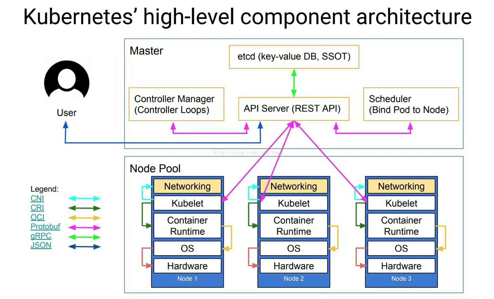
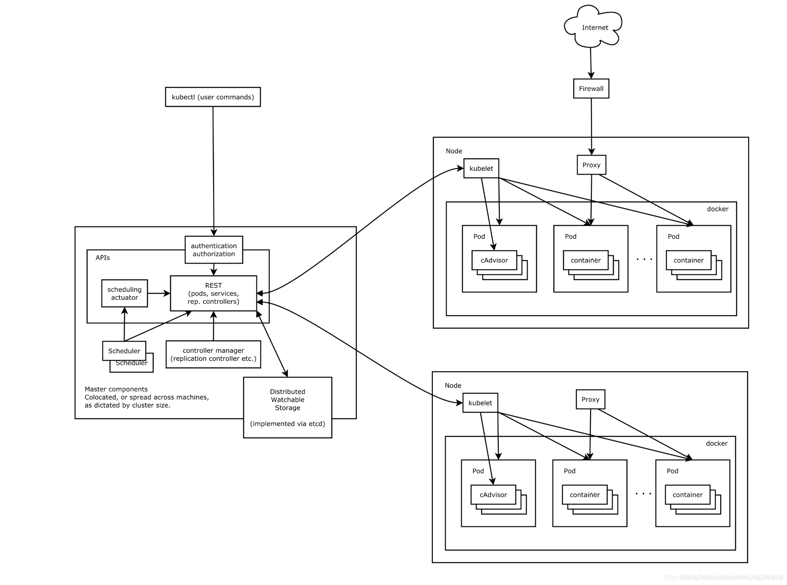
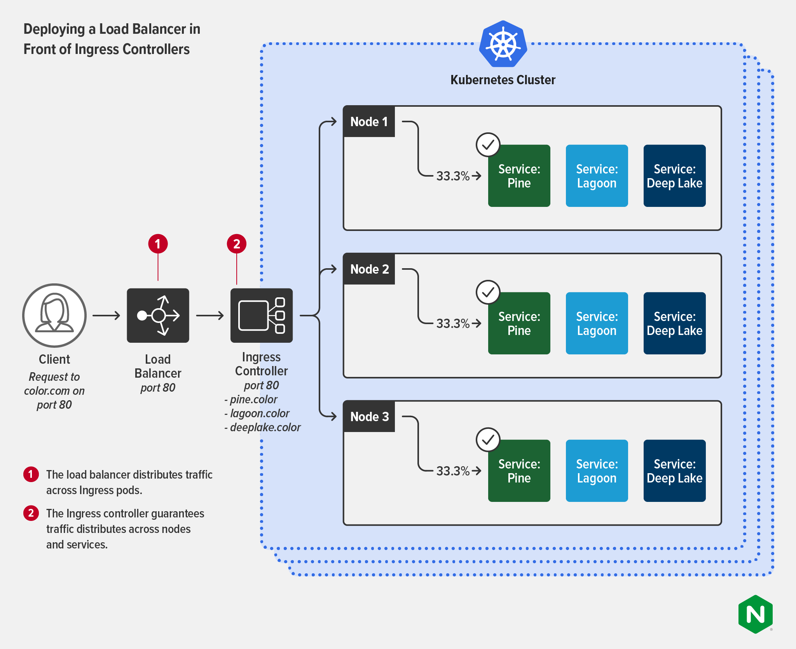

# 裸机安装服务网格


1. 这是什么:    
这是一篇在裸系统上安装服务网格的系列教程，分基础环境(Basic ENV)和持续集成和持续发布环境(CICD ENV)两部分。   
    - 基础环境将会演示如何在裸机上安装部署k8s和istio，及一些相关的特性。      
    - 持续集成和持续发布环境会用开源组件构建一整套的从开发到发布的pipeline的环境。后续，会在追踪业界动态，看看有啥好玩的，往里面整整。    
2. 为什么要做这个事情:    
    - 虽然有minikube这类的工具让使用者了解k8s,istio不需要进行繁琐的安装过程， 但是在尽可能真实的环境下动手搞一遍，是一个工程师的本能驱动。  
    - 最近在梳理服务网格方面的知识， 搭建了相关的环境，整理了相关的脚本和文档后，索性做成了一篇教程。    
3. 适合的读者：  
    - 初学者   
    - 喜欢更细粒度的掌控和了解 k8s与istio的人。
4. 有什么特点: 
    - 本教程基本将按照官方文档进行搭建部署。对于一些错误的修正，也将会尽可能给出参考引用。
    - 如果有时间我尽量制作视频。
    - 安装脚本，虚拟机镜像制作，皆可使用。
    - 不仅仅是安装，具体会塞什么进去，我现在也还不太确定,看心情和我的时间吧。
5. 最后:有什么好的建议，欢迎留言。 但我不保证一定采纳。

    ----------运维.林


## 背景知识简单介绍
 在开始之前有必要从很高的抽象层面去我们要搭建的目标到底是什么样的，官方的图片太过于抽象，我找了比较具体一点的架构图。   
高级抽象图   
   
   
节点协作关系图    

k8s的流量流图


## 基础环境部分
###  在开始之前的准备清单  

1. 有一个可以访问google等地址的路由。    
 目录 [prepare](prepare)
   相信我，网络上所有需要修改镜像仓库之类的教程，并不适合初学者。通常拔萝卜会带出一大堆坑，初学者常常会因为信息不对称而陷入不可掌控的境地，因为很多时候，你不是知道是因为你的安装过程出了错，还是因为其中的某些个组件的网络不可访问出了错，所以还不如在一开始就解决掉这个问题。    
    - 我听说 这个 帖子 https://zhuanlan.zhihu.com/p/423684520 可以解决问题， 
    - 我听说，要是觉得机器太贵，那么树莓派之类的可以比较适合当旁路路由， 其实虚拟机理论上也是可以的。
    - 我听说 配置文件要将 redir-host 切换成 fake-ip ,但也听说prepare目录已经配置好了，替换掉某些p内容就可以用了。 
    - 我听说vpn速度不仅慢，而且很容易受骗，刚开始几天是能用的后面就不行了。 
    - 别问我什么机场。 我不懂。 
2. 一台16c32G，空余硬盘空间至少60G的ubuntu主机。 将采用ubuntu下的轻量级虚拟机 multipass 创建1个master node 2个work node。

### 安装
刚开始的时候，我做了一个简单的规划后，就照安装文档开始了，因为是有时间的时候断断续续搞得，容易忘记，所以就写了个简单的replay脚本。后来发现每次replay的时候，都需要花费很长时间在下载更新包上， 系统的更新包， 镜像的拉取等是大头的。于是就研究了一下怎么制作虚拟机镜像，将需要用到的部分打包到虚拟机镜像中，这样可很快地加快部署速度，在演示基础环境。    
安装过程将分几个阶段 
* 主机环境设置
* 节点初始化    
有三种选择
  - 手工命令行方式
  - 简单自动化脚本
  - 虚拟机镜像
* k8s 集群初始化
* istio安装 && demo部署 &&  观测套件安装
* 观测套件使用
* istio特性展示
----------    
#### 主机环境设置
1. 查看宿主主机所使用的网卡，确定地址，我用的是无线网卡。
```
alan@alan-pc:~$ iwconfig
lo        no wireless extensions.

eno1      no wireless extensions.

wlp3s0    IEEE 802.11  ESSID:"linc-hwlink"
          Mode:Managed  Frequency:2.437 GHz  Access Point: 28:64:B0:AA:F1:84
          Bit Rate=172 Mb/s   Tx-Power=22 dBm
          Retry short limit:7   RTS thr:off   Fragment thr:off
          Power Management:on
          Link Quality=46/70  Signal level=-64 dBm
          Rx invalid nwid:0  Rx invalid crypt:0  Rx invalid frag:0
          Tx excessive retries:0  Invalid misc:11   Missed beacon:0
          
alan@alan-pc:~$ ip addr |grep wlp3s0
3: wlp3s0: <BROADCAST,MULTICAST,UP,LOWER_UP> mtu 1500 qdisc noqueue state UP group default qlen 1000
    inet 192.168.3.13/24 brd 192.168.3.255 scope global dynamic noprefixroute wlp3s0
                 
```
2. 查看并设置本机路由
```
alan@alan-pc:~$ route -n
Kernel IP routing table
Destination     Gateway         Genmask         Flags Metric Ref    Use Iface
0.0.0.0         192.168.3.1     0.0.0.0         UG    600    0        0 wlp3s0
192.168.3.0     0.0.0.0         255.255.255.0   U     600    0        0 wlp3s0
```
我的旁路路由是 192.168.3.53。使用 命令将
```
sudo route add -net 0.0.0.0 gw 192.168.3.53 dev wlp3s0
```
再次查看
```
alan@alan-pc:~$ route -n
Kernel IP routing table
Destination     Gateway         Genmask         Flags Metric Ref    Use Iface
0.0.0.0         192.168.3.53    0.0.0.0         UG    0      0        0 wlp3s0
0.0.0.0         192.168.3.1     0.0.0.0         UG    600    0        0 wlp3s0
192.168.3.0     0.0.0.0         255.255.255.0   U     600    0        0 wlp3s0
```
3. 测试网络连通性
```
alan@alan-pc:~$ curl google.com
<HTML><HEAD><meta http-equiv="content-type" content="text/html;charset=utf-8">
<TITLE>302 Moved</TITLE></HEAD><BODY>
<H1>302 Moved</H1>
The document has moved
<A HREF="http://www.google.com/sorry/index?continue=http://google.com/&amp;q=EhAkAIkBAAAAAPA8k__-XyRtGIWT4KcGIilmJkKdjiOdUzQsNf-tCZqdRsRmtOiPG1Yhu4Qdj1doQIxicw-eD5jSADIBcloBQw">here</A>.
</BODY></HTML>
```
4. 虚拟机的创建
```
# 要想在新的系统上从零开始安装 用这个命令
multipass launch -c 4 -m 8G --disk 23G -n m01 lunar
multipass launch -c 4 -m 8G --disk 23G -n w01 lunar
multipass launch -c 4 -m 8G --disk 23G -n w01 lunar
```
你也可以运行 installation/1_node_create/script/create_vm.sh

当你下面在初始化节点步骤采用选择三时，你应该先在宿主机构建镜像。
执行构建过程后， 镜像在构建目录 output-qemu/下，名为packer-qemu。
请注意: 尽量不要在构建过程中执行编译命令，qemu在默认情况下性能很糟糕。
```
# 打包参考引用  https://multipass.run/docs/building-multipass-images-with-packer
cd bare_metal_servicemesh/packer
packer build template.json | tee packer_build.log
```
关于构建好的虚拟机镜像，我也上传了一份到 百度网盘，可以下载到 bare_metal_servicemesh/packer/output-qemu目录 名字更改为 packer-qemu
```
链接：https://pan.baidu.com/s/1Ny2aJUsQMuejOg39pEkwkQ?pwd=k8si 
提取码：k8si
```   
使用自定义镜像来创建虚拟机。
```
cd sh installation/0_node_init/packer/create_vm.sh
```

5. 检查主机是否存在，以及状态是否正常
```
multipass list
```
6. 主机安装packer 
```
sudo apt install packer qemu-kvm
```
7. 下载本教程仓库到 当前用户目录下  ~
```
git clone https://github.com/alan2lin/bare_metal_servicemesh.git
```

----------    
#### 初始化节点
当一个新的物理节点加入进来的时候，需要在其上安装必要的安装包，容器运行时和k8s的组件。

##### 选择一: 逐条执行脚本
每一个虚拟机节点安装k8s,以 m01为例子。  
* 先进入虚拟机   
```
multipass shell m01   
```    
* 更新系统包
```
# node package up to new  install 
sudo NEEDRESTART_MODE=a apt-get update -y
sudo NEEDRESTART_MODE=a apt-get upgrade -y

sudo NEEDRESTART_MODE=a apt-get install -y git snap make
```


* 安装的参考文档将从这个开始:  https://kubernetes.io/zh-cn/docs/setup/production-environment/tools/kubeadm/install-kubeadm/     
第一步是安装容器运行时， 有四种容器运行时，这里选择 docker
https://kubernetes.io/zh-cn/docs/setup/production-environment/container-runtimes/   
安装前或者安装后，需要先设定一下网络转发的设置。然后按照参考文档  https://docs.docker.com/engine/install/ubuntu/  安装docker    
因为k8s v1.24之后，移除了内部集成的dockershim,所以在安装完docker后，还需要安装一个
 cri-dockerd，它相当于一个桥接的作用。 
具体的示意图如下:   
v.1.24之前

v1.24之后


* docker的安装
```
sudo NEEDRESTART_MODE=a apt-get remove -y docker docker-engine docker.io containerd runc
sudo NEEDRESTART_MODE=a apt-get  install -y \
    ca-certificates \
    curl \
    gnupg \
    lsb-release

curl -fsSL https://download.docker.com/linux/ubuntu/gpg | sudo gpg --dearmor -o /usr/share/keyrings/docker-archive-keyring.gpg
 echo \
  "deb [arch=$(dpkg --print-architecture) signed-by=/usr/share/keyrings/docker-archive-keyring.gpg] https://download.docker.com/linux/ubuntu \
   $(lsb_release -cs) stable" | sudo tee /etc/apt/sources.list.d/docker.list > /dev/null

sudo NEEDRESTART_MODE=a apt-get update -y
sudo NEEDRESTART_MODE=a apt-get install -y docker-ce docker-ce-cli containerd.io docker-compose-plugin

sudo groupadd docker
sudo usermod -aG docker $USER
sudo systemctl enable docker
sudo systemctl start docker

sudo docker run hello-world
```    

* cri-dockerd的安装
```
# install cri-dockerd
## Forwarding IPv4 and letting iptables see bridged traffic 
cat <<EOF | sudo tee /etc/modules-load.d/k8s.conf
overlay
br_netfilter
EOF

sudo modprobe overlay
sudo modprobe br_netfilter

## sysctl params required by setup, params persist across reboots
cat <<EOF | sudo tee /etc/sysctl.d/k8s.conf
net.bridge.bridge-nf-call-iptables  = 1
net.bridge.bridge-nf-call-ip6tables = 1
net.ipv4.ip_forward                 = 1
EOF


### Apply sysctl params without reboot
sudo sysctl --system

### Verify that the br_netfilter, overlay modules are loaded by running the following commands:
lsmod | grep br_netfilter
lsmod | grep overlay

### Verify that the net.bridge.bridge-nf-call-iptables, net.bridge.bridge-nf-call-ip6tables, and net.ipv4.ip_forward system variables are set to 1 in your sysctl config by running the following command:
sudo sysctl net.bridge.bridge-nf-call-iptables net.bridge.bridge-nf-call-ip6tables net.ipv4.ip_forward

### verify cgroup v2   https://blog.csdn.net/Kiritow/article/details/118079768
cat /sys/fs/cgroup/cgroup.controllers

## https://github.com/Mirantis/cri-dockerd
sudo add-apt-repository -y ppa:longsleep/golang-backports
sudo NEEDRESTART_MODE=a snap install yq go  --classic

## git clone https://github.com/Mirantis/cri-dockerd.git
cd ${BASEDIR}/data
cd cri-dockerd
make cri-dockerd

## Run these commands as root

sudo mkdir -p /usr/local/bin
sudo install -o root -g root -m 0755 cri-dockerd /usr/local/bin/cri-dockerd
make clean

sudo cp -a packaging/systemd/* /etc/systemd/system
sudo sed -i -e 's,/usr/bin/cri-dockerd,/usr/local/bin/cri-dockerd,' /etc/systemd/system/cri-docker.service
sudo systemctl daemon-reload
sudo systemctl enable cri-docker.service
sudo systemctl enable --now cri-docker.socket

cd ..
```

安装k8s
```
# install kubectl
## 
sudo NEEDRESTART_MODE=a apt-get update -y
sudo NEEDRESTART_MODE=a apt-get install -y apt-transport-https ca-certificates curl

K8SVER=v1.28
sudo curl -fsSL https://pkgs.k8s.io/core:/stable:/${K8SVER}/deb/Release.key | sudo gpg --dearmor -o /etc/apt/keyrings/kubernetes-apt-keyring.gpg
echo "deb [signed-by=/etc/apt/keyrings/kubernetes-apt-keyring.gpg] https://pkgs.k8s.io/core:/stable:/${K8SVER}/deb/ /" | sudo tee /etc/apt/sources.list.d/kubernetes.list


sudo NEEDRESTART_MODE=a apt-get update -y
sudo NEEDRESTART_MODE=a apt-get install -y kubelet kubeadm kubectl
sudo NEEDRESTART_MODE=a apt-mark hold kubelet kubeadm kubectl
```

##### 选择二: 执行脚本
确保已经在虚拟机内，比如在m01内。
```
sh /bms/installation/1_node_init/script/node_init.sh

```

##### 选择三: 以自定义的镜像来创建镜像，什么都不用做
因为所有的工作都在创建镜像的时候做了。

#### k8s 集群初始化
##### 选择一: 逐条执行脚本

* 先修正一个bug后面才可能出现的bug.   
大约是启用 反向路径过滤器，哪些不能互通的请求会被iptable过滤掉。
```
# https://github.com/projectcalico/calico/issues/2042  
cat <<EOF | sudo tee /etc/sysctl.d/99-kubernetes-cri.conf
net.bridge.bridge-nf-call-iptables  = 1
net.ipv4.ip_forward                 = 1
net.bridge.bridge-nf-call-ip6tables = 1
##The following two settings solve the issue.I tried to comment it out and the issue reappeared.
net.ipv4.conf.default.rp_filter=1
net.ipv4.conf.all.rp_filter=1
EOF

sudo sysctl --system
```
* 初始化master节点
```
sudo kubeadm init --pod-network-cidr=192.168.0.0/16 --cri-socket=unix:///var/run/cri-dockerd.sock --v=5
```
* 加入其他工作节点   
逐一登录其他节点 执行这个命令打出来的 join语句 ，记得带上  --cri-socket=unix:///var/run/cri-dockerd.sock --v=5
```
# 如果在m01中，则先 exit 
multipass shell w01

sudo kubeadm join 10.199.97.12:6443 --token xxx --discovery-token-ca-cert-hash sha256:yyy  --cri-socket=unix:///var/run/cri-dockerd.sock --v=5 
exit
multipass shell w02

sudo kubeadm join 10.199.97.12:6443 --token xxx --discovery-token-ca-cert-hash sha256:yyy  --cri-socket=unix:///var/run/cri-dockerd.sock --v=5 
exit
```
* 设置 kubectl的配置文件
```
mkdir -p $HOME/.kube
sudo cp -i /etc/kubernetes/admin.conf $HOME/.kube/config
sudo chown $(id -u):$(id -g) $HOME/.kube/config

echo "source <(kubectl completion bash)" >> ~/.bashrc
```

* 在master节点上安装插件
```
# https://docs.tigera.io/calico/latest/getting-started/kubernetes/self-managed-onprem/onpremises
# curl https://raw.githubusercontent.com/projectcalico/calico/v3.26.1/manifests/calico-typha.yaml -o calico.yaml
kubectl  create -f /bms/data/k8s_addons/calico/calico.yaml
```
* 一些可能会用到的命令
```
# kubectl get events --sort-by=.metadata.creationTimestamp -A --watch
# kubectl get nodes -o wide
# kubeadm token create --print-join-command
```
##### 选择二: 执行脚本
* 执行脚本初始化master
```
sh /bms/installation/2_k8s_init/k8s_master_init.sh
```

* 加入其他的工作节点     
逐一登录其他节点 执行这个命令打出来的 join语句 ，记得带上  --cri-socket=unix:///var/run/cri-dockerd.sock --v=5
```
# 如果在m01中，则先 exit 
multipass shell w01

sudo kubeadm join 10.199.97.12:6443 --token xxx --discovery-token-ca-cert-hash sha256:yyy  --cri-socket=unix:///var/run/cri-dockerd.sock --v=5 
exit
multipass shell w02

sudo kubeadm join 10.199.97.12:6443 --token xxx --discovery-token-ca-cert-hash sha256:yyy  --cri-socket=unix:///var/run/cri-dockerd.sock --v=5 
exit
```
##### 通过helm 安装 metrics-server 
这个应用可以让你用top node, top pod 来查看他们的cpu和内存负载等信息。
```
# 安装 Metrics Server is a scalable, efficient source of container resource metrics for Kubernetes built-in autoscaling pipelines.
# https://artifacthub.io/packages/helm/metrics-server/metrics-server

helm repo add metrics-server https://kubernetes-sigs.github.io/metrics-server/ 
helm upgrade --install metrics-server metrics-server/metrics-server --set args="{--kubelet-insecure-tls}"  
# kubectl top node 
# kubectl top pods
``` 

##### 安装 安装负载均衡器 metallb
如果是在云平台，一般都会提供一个外部负载均衡器。 这样就可以通过集群外的ip来访问应用了。 我们采用metallb

```
# 安装负载均衡器
# https://metallb.universe.tf/installation/
  
# see what changes would be made, returns nonzero returncode if different
kubectl get configmap kube-proxy -n kube-system -o yaml | \
sed -e "s/strictARP: false/strictARP: true/" | \
kubectl diff -f - -n kube-system

# actually apply the changes, returns nonzero returncode on errors only
kubectl get configmap kube-proxy -n kube-system -o yaml | \
sed -e "s/strictARP: false/strictARP: true/" | \
kubectl apply -f - -n kube-system

  
kubectl  apply -f /bms/data/metallb_install/metallb-0.13.10/config/manifests/metallb-native.yaml
kubectl  apply -f /bms/data/metallb_install/metallb-0.13.10/config/manifests/metallb-frr.yaml
# 修改该文件，增加node节点的 ip地址范围
kubectl  apply -f /bms/data/metallb_install/metallb-0.13.10/configsamples/ipaddresspool_simple.yaml

kubectl  apply -f /bms/data/metallb_install/nginx-deployment.yaml
kubectl expose deployment nginx-deployment --port 80 --type LoadBalancer 	
# 检查和校验的
```
----------    

#### istio安装 && demo部署 &&  观测套件安装


* 安装istio 及demo 
```
# https://istio.io/latest/docs/setup/getting-started/
# mkdir /bms/data/istio_install/ 
cd /bms/data/istio_install/
# wget https://github.com/istio/istio/releases/download/1.19.0/istio-1.19.0-linux-arm64.tar.gz  
 rm -rf istio-1.19.0
tar -xzvf istio-1.19.0-linux-arm64.tar.gz
cd /bms/data/istio_install/istio-1.19.0

./bin/istioctl install --set profile=demo -y
kubectl get ns --show-lables
kubectl label namespace default istio-injection=enabled

```
* 安装 bookinfo应用
```
kubectl apply -f samples/bookinfo/platform/kube/bookinfo.yaml
```
* 添加一个pv
```
mkdir -p /mnt/data/
cat <<EOF |tee /bms/data/istio_install/pv-volume.yaml
apiVersion: v1
kind: PersistentVolume
metadata:
  name: task-pv-volume
  labels:
    type: local
spec:
  storageClassName: manual
  capacity:
    storage: 12Gi
  accessModes:
    - ReadWriteOnce
  hostPath:
    path: "/mnt/data"
EOF

kubectl apply -f /bms/data/istio_install/pv-volume.yaml
```
* 安装 istio插件
```
# 修改 loki.yaml 

#spec.template.spec.securityContext:
#    fsGroup: 0 #10001
#	runAsNonRoot: false #true
#	runAsUser: 0 #10001
#	
#spec.template.volumeClaimTemplates.storageClassName: manual

sudo yq -i 'spec.template.spec.securityContext.fsGroup=0 | spec.template.spec.securityContext.runAsNonRoot=false |  spec.template.spec.securityContext.runAsUser=0 | spec.template.volumeClaimTemplates.storageClassName="manual"'   samples/addons/loki.yaml

# sed -in-place -e "s/fsGroup: 10001/fsGroup: 0 #10001/;s/runAsNonRoot: true/runAsNonRoot: false #true/;s/runAsUser: 10001/runAsUser: 0 #10001" samples/addons/loki.yaml


kubectl apply -f samples/addons 
kubectl rollout status deployment/kiali -n istio-system
```
* 查看
```
kubectl get svc istio-ingressgateway -n istio-system

export INGRESS_HOST=$(kubectl -n istio-system get service istio-ingressgateway -o jsonpath='{.status.loadBalancer.ingress[0].ip}')
export INGRESS_PORT=$(kubectl -n istio-system get service istio-ingressgateway -o jsonpath='{.spec.ports[?(@.name=="http2")].port}')
export SECURE_INGRESS_PORT=$(kubectl -n istio-system get service istio-ingressgateway -o jsonpath='{.spec.ports[?(@.name=="https")].port}')

export GATEWAY_URL=$INGRESS_HOST:$INGRESS_PORT
echo "$GATEWAY_URL"
echo "http://$GATEWAY_URL/productpage"


```
#### 观测套件使用
##### 
* 观测套件的使用之一 --- loki     
先收集数据
```
for i in $(seq 1 100); do curl -s -o /dev/null "http://$GATEWAY_URL/productpage"; done
```
暴露服务
```

```
在master节点的host上 安装一个配置方向代理服务
```
cat /bare_metal_servicemesh/node_proxy/my-proxy.conf

sh cat /bare_metal_servicemesh/node_proxy/nginx.sh
```
打开浏览器

